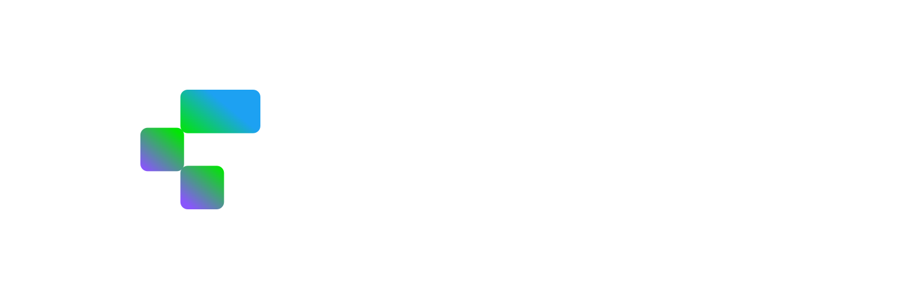

```md
<div align="center">

<br/>



<br/>
<br/>

https://github.com/user-attachments/assets/live-demo.mp4

<br/>

### [▶ Live Demo](https://petrnzi.github.io/streamvault/)

<br/>


</div>

---

## What is StreamVault?

StreamVault is a **unified real-time chat aggregator** built for professional streamers who multistream across platforms. Instead of managing three separate browser tabs, StreamVault brings every voice into a single, dark-premium interface — with live analytics that tell you *exactly* what your audience is feeling.

> **One window. Every voice.** Built for the [MarketBubble $10k Vibe Code Challenge](https://x.com/marketbubble).

---

## The Problem It Solves

Multi-platform streamers face a real operational problem: Twitch, Kick, and X chats move simultaneously, on separate windows, with no unified view. Missing a highlight moment, a first-time chatter, or a raid announcement on the wrong tab is the norm — not the exception.

StreamVault fixes this with:
- One scrolling feed for all three platforms
- Color-coded **source labels** on every message — instant recognition
- **Stream Intelligence Panel** — live hype meter, chat velocity, keyword trends, platform split
- **OBS Browser Source mode** — the aggregated chat becomes a stream overlay

---

## Features

<table>
<tr>
<td width="50%" valign="top">

### 💬 Chat Core
- Real-time messages from **Twitch**, **Kick**, and **X**
- Platform logo on every message — instant source recognition
- Platform filter toggles (show/hide per source)
- Keyword search with 150ms debounce
- Auto-scroll with "N new messages" badge when paused
- First-time chatter detection & highlighting
- Sub/follow event banners with gold gradient
- @mention auto-highlight in platform color
- Animated gradient username for **subscribers & verified** users (`#1DA1F2 → #00E701 → #8956FB`)
- White username + platform logo for regular users

</td>
<td width="50%" valign="top">

### 📊 Stream Intelligence Panel
- **Hype Meter** — SVG semicircle gauge, spring-animated needle
- **Chat Velocity** — messages/min with 60s sparkline history chart
- **Platform Split** — proportional animated activity bar
- **Trending Words** — top 5 keywords from last 30 seconds
- **Active Users** — unique chatters in last 60 seconds
- Updates every second, zero external API calls

</td>
</tr>
<tr>
<td width="50%" valign="top">

### 🎬 OBS Browser Source (`/obs`)
- Fully transparent background for stream overlays
- Three visual styles: `pill`, `line`, `ghost`
- Per-message TTL auto-expire (default 25s)
- Fully configurable via URL params
- GPU-composited for zero performance impact

</td>
<td width="50%" valign="top">

### ⚙️ Settings & Config
- Font size slider (11–20px), live preview
- Compact mode for high-density feeds
- Toggle timestamps & user badges
- Max messages cap (100 / 200 / 500)
- X API Mode with Bearer Token (session-only, never stored)
- CSV export of full chat log
- All settings persisted in localStorage

</td>
</tr>
</table>

---

## Architecture

```
┌─────────────────────────────────────────────────────────────────────┐
│                         StreamVault                                 │
├─────────────────────────────────────────────────────────────────────┤
│  MockChatEngine  (src/engine/)                                      │
│  ┌──────────────────────────────────────────────────────────────┐   │
│  │  Twitch 60% ──┐                                              │   │
│  │  Kick    30% ──┼──► generateMessage() ──► Listener.forEach() │   │
│  │  X       10% ──┘         ↑                                   │   │
│  │                    parseMessage()  +  colorForUsername()     │   │
│  │                    XSS-safe URL validation                   │   │
│  │                    Burst pattern: 90–120s interval, 15s peak │   │
│  └──────────────────────────────────────────────────────────────┘   │
│                          │                                          │
│               useMessages(maxMessages)                              │
│                          │                                          │
│          ┌───────────────┴────────────────┐                         │
│          │                                │                         │
│   useChatAnalytics()               ChatFeed + ChatMessage           │
│   ┌───────────────────┐             ┌───────────────────────┐       │
│   │ Hype Meter        │             │ Framer Motion enter   │       │
│   │ Velocity sparkline│             │ Platform logo badge   │       │
│   │ Platform split    │             │ Premium gradient name │       │
│   │ Top keywords      │             │ Action bar on hover   │       │
│   │ Active users      │             │ Auto-scroll / pause   │       │
│   └───────────────────┘             └───────────────────────┘       │
│                                                                     │
│  Routes:  / (main app)  ·  /obs (OBS overlay)                      │
│                                                                     │
│  Replace MockChatEngine → Socket.io backend for live platform APIs  │
└─────────────────────────────────────────────────────────────────────┘
```

---

## Tech Stack

| Layer | Technology | Version |
|-------|-----------|---------|
| UI Framework | React + TypeScript | 19 / 5.8 |
| Build Tool | Vite | 7 |
| Router | React Router | 7 |
| Styling | Tailwind CSS | v4 |
| Animation | Framer Motion | 12 |
| Charts | Recharts | 3 |
| Icons | Lucide React | 0.575 |
| Fonts | Geist Sans + Geist Mono | 5.x |

---

## Quick Start

```bash
git clone https://github.com/petrnzi/streamvault.git
cd streamvault
npm install
npm run dev
# → http://localhost:5173
```

```bash
# Production build
npm run build
npm run preview
```

### Optional: X (Twitter) API

```bash
cp .env.example .env.local
# Add your Bearer Token:
# VITE_X_BEARER_TOKEN=your_token_here
```

Then open **Settings → X Integration → API Mode**.

> **Security:** The Bearer Token lives only in memory for the session. Never written to localStorage.

---

## OBS Browser Source Setup

1. In OBS → **Add Source → Browser Source**
2. URL: `https://petrnzi.github.io/streamvault/#/obs`
3. Width: `400` · Height: `800`
4. ✅ **Shutdown source when not visible**

**URL Parameters:**

| Param | Default | Options |
|-------|---------|---------|
| `platforms` | `twitch,kick,x` | comma-separated |
| `ttl` | `25` | seconds before message fades |
| `fontSize` | `15` | px |
| `style` | `pill` | `pill` · `line` · `ghost` |
| `position` | `bottom` | `bottom` · `top` |
| `maxMessages` | `30` | count |

---

## Project Structure

```
streamvault/
├── public/assets/          # Platform logos + brand assets
├── src/
│   ├── components/
│   │   ├── chat/           # ChatFeed, ChatMessage
│   │   ├── intelligence/   # HypeMeter, VelocityCard, PlatformSplit,
│   │   │                   # TopKeywords, ActiveUsers
│   │   ├── layout/         # AppHeader, LeftSidebar, IntelligencePanel,
│   │   │                   # StatusBar, SettingsPanel
│   │   └── ui/             # PlatformBadge, PlatformLogo, UserAvatar,
│   │                       # UserBadges, SwitchToggle
│   ├── engine/
│   │   └── MockChatEngine.ts   # Realistic burst-pattern simulator
│   ├── hooks/
│   │   ├── useChatAnalytics.ts
│   │   ├── useDebounce.ts
│   │   ├── useInterval.ts
│   │   ├── useMessages.ts
│   │   └── useSettings.ts
│   ├── lib/
│   │   ├── colorUtils.ts   # Username → deterministic HSL color
│   │   ├── formatters.ts   # Time, number, duration
│   │   ├── platforms.ts    # Platform metadata
│   │   ├── textParser.ts   # XSS-safe message segment parser
│   │   └── utils.ts        # cn() Tailwind helper
│   ├── pages/
│   │   ├── Index.tsx       # Main dashboard
│   │   └── OBSMode.tsx     # OBS overlay
│   └── types/
│       ├── chat.ts
│       ├── platform.ts
│       └── settings.ts
├── .env.example
├── index.html
├── package.json
└── vite.config.ts
```

---

## Roadmap

- [ ] **Twitch live** — tmi.js IRC WebSocket (no auth needed for read)
- [ ] **Kick live** — Pusher WebSocket (public channels)
- [ ] **X live** — API v2 filtered stream or search polling
- [ ] **Sound alerts** — Web Audio API for sub/raid notifications
- [ ] **Multi-channel** — connect multiple channels per platform
- [ ] **Message pinning** — persistent pinned messages at feed top
- [ ] **Clip detection** — auto-detect "clip it" spikes

---

## License

MIT — see [LICENSE](./LICENSE)

---

<div align="center">

Built for the **[MarketBubble $10k Vibe Code Challenge](https://x.com/marketbubble)**

*StreamVault — One window. Every voice.*


</div>
```
